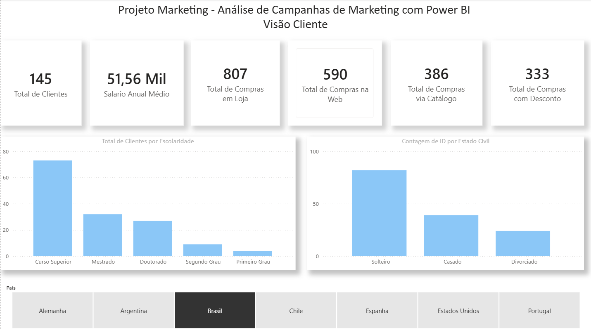
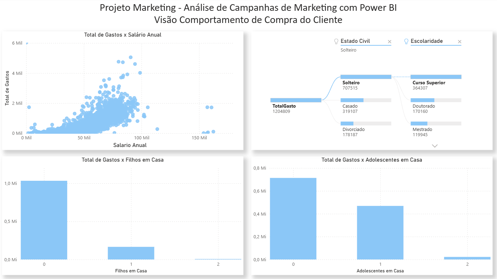
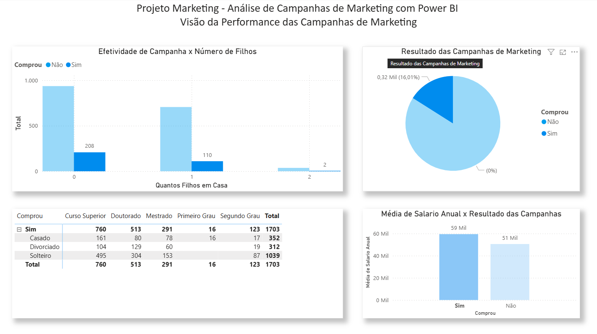
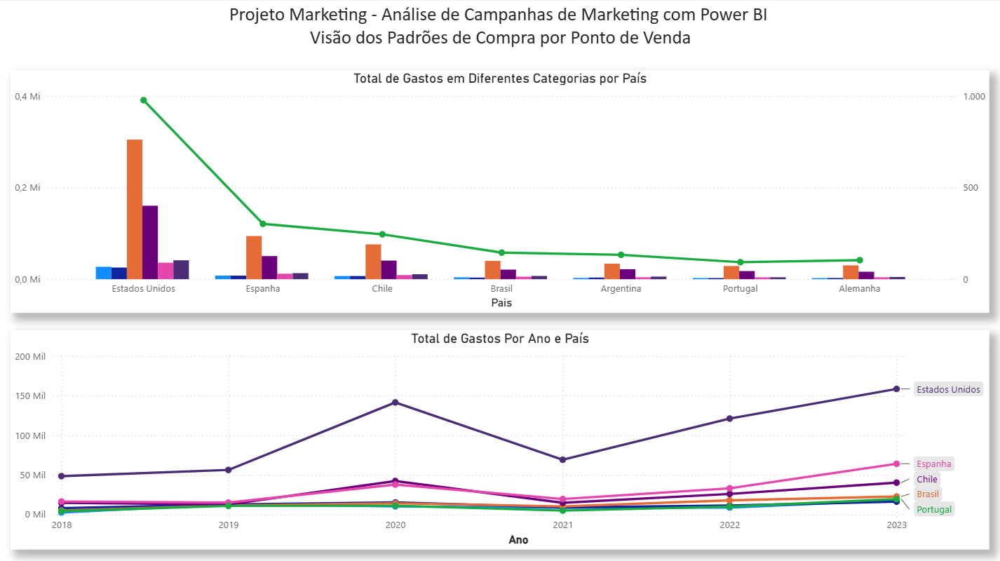

# 📊 Projeto de Marketing Analytics com Power BI

Projeto desenvolvido durante o curso de Power BI da Data Science Academy com foco em análise de campanhas de marketing, comportamento de clientes e geração de insights estratégicos através de dashboards interativos.

---

# 🎯 Objetivo do Projeto

Este projeto tem como objetivo realizar a análise de dados de campanhas de marketing utilizando o Power BI, explorando recursos de visualização, modelagem de dados, criação de métricas e construção de dashboards analíticos.

Os dados representam informações de clientes, campanhas de marketing e padrões de compra, permitindo gerar insights para apoio à tomada de decisão.

---

# 🛠️ Ferramentas Utilizadas

- Power BI
- Power Query
- DAX
- CSV
- Modelagem de Dados
- Visualização de Dados

---

# 📈 Dashboards Desenvolvidos

O projeto foi dividido em 4 visões analíticas:

## 👤 Visão do Cliente
Análise do perfil dos clientes, características demográficas e segmentação.

## 🛒 Visão do Comportamento de Compra
Análise dos hábitos de consumo e padrões de compra dos clientes.

## 📢 Visão da Performance das Campanhas de Marketing
Avaliação da efetividade das campanhas, métricas de desempenho e impacto nas vendas.

## 🌍 Visão dos Padrões de Compra por País
Análise geográfica dos padrões de compra no ponto de venda.

---

# 📌 Principais Recursos Aplicados

- Criação de dashboards interativos
- Construção de medidas com DAX
- Tratamento e transformação de dados
- Correção e padronização de dados
- Criação de gráficos e indicadores
- Cruzamento de métricas
- Customização visual dos dashboards

---

# 📷 Preview do Dashboard

## Dashboard 1


## Dashboard 2


## Dashboard 3


## Dashboard 4


---

# 📂 Estrutura do Projeto

```bash
projeto-marketing-powerbi/
│
├── dashboard/
│   └── marketing_analytics.pbix
│
├── dados/
│   └── dataset_marketing.csv
│
├── imagens/
│   ├── dashboard1.png
│   ├── dashboard2.png
│   ├── dashboard3.png
│   └── dashboard4.png
│
└── README.md
```

---

# 🚀 Aprendizados

Durante o desenvolvimento deste projeto foram praticados conceitos importantes de:

- Business Intelligence
- Storytelling com Dados
- Modelagem de Dados
- Criação de KPIs
- Análise Exploratória de Dados
- Visualização de Dados no Power BI

---

# 👨‍💻 Autor

Ricardo Ferraz

Projeto desenvolvido para fins de estudo e prática em análise de dados e Power BI.